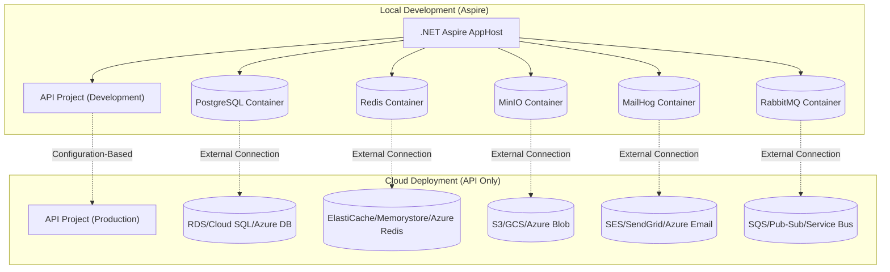

# NDC Deployment Architecture - Aspire for Local DX Only

## Overview

NDC leverages .NET Aspire **exclusively for local development experience** while deploying **only the API/Web App** to production cloud services.

## Architecture Separation



## Project Structure

### Generated Structure
```
MyApp/
├── src/
│   ├── MyApp.AppHost/           # LOCAL ONLY - Aspire orchestration
│   ├── MyApp.Api/               # DEPLOYED - Main application
│   └── MyApp.ServiceDefaults/   # SHARED - Configuration helpers
├── terraform/                   # Cloud infrastructure (no Aspire)
├── docker-compose.yml          # Alternative local development
├── Dockerfile                  # Builds ONLY the API project
├── README.md
└── MyApp.sln
```

### Key Points
- **AppHost**: Used only for local development orchestration
- **API Project**: Self-contained, deployable application
- **Dockerfile**: Builds only the API project, not AppHost
- **Configuration**: Environment-based service discovery

## Service Discovery Pattern

### API Project Configuration (appsettings.json)
```json
{
  "ConnectionStrings": {
    "Database": "", // Populated by environment/cloud
    "Redis": "",    // Populated by environment/cloud
    "Storage": ""   // Populated by environment/cloud
  },
  "Services": {
    "Database": {
      "Type": "PostgreSQL", // Drives local container choice
      "Provider": "Npgsql"   // EF Core provider
    },
    "Cache": {
      "Type": "Redis",
      "Enabled": true
    },
    "Storage": {
      "Type": "S3",
      "Bucket": "${SERVICE_NAME}-storage"
    },
    "Email": {
      "Type": "SMTP",
      "Provider": "Local", // "SES", "SendGrid", etc.
      "From": "noreply@myapp.com"
    },
    "MessageQueue": {
      "Type": "Memory", // Local fallback
      "Provider": "SQS" // Cloud provider
    },
    "Jobs": {
      "Type": "Hangfire",
      "Storage": "Database"
    }
  }
}
```

### Local Development (Aspire reads config)
```csharp
// AppHost/Program.cs - reads API configuration
var builder = DistributedApplication.CreateBuilder(args);

// Read API project configuration to determine services
var apiConfig = ReadApiConfiguration();

// Start services based on API configuration
if (apiConfig.Database.Type == "PostgreSQL")
    var postgres = builder.AddPostgreSQL("postgres");

if (apiConfig.Cache.Enabled)
    var redis = builder.AddRedis("redis");

// API project with service references
var api = builder.AddProject<Projects.MyApp_Api>("api")
    .WithReference(postgres) // Connection string auto-injected
    .WithReference(redis);

builder.Build().Run();
```

### Production Deployment (API only)
```csharp
// API/Program.cs - uses external services via configuration
var builder = WebApplication.CreateBuilder(args);

// Services configured via environment variables
builder.Services.AddDbContext<AppDbContext>(options =>
{
    var dbType = builder.Configuration["Services:Database:Type"];
    var connectionString = builder.Configuration.GetConnectionString("Database");
    
    switch (dbType)
    {
        case "PostgreSQL":
            options.UseNpgsql(connectionString);
            break;
        case "MySQL":
            options.UseMySql(connectionString, ServerVersion.AutoDetect(connectionString));
            break;
        case "SqlServer":
            options.UseSqlServer(connectionString);
            break;
    }
});

// Cache service
if (builder.Configuration.GetValue<bool>("Services:Cache:Enabled"))
{
    var cacheConnectionString = builder.Configuration.GetConnectionString("Redis");
    builder.Services.AddStackExchangeRedisCache(options =>
    {
        options.Configuration = cacheConnectionString;
    });
}

var app = builder.Build();
```

## Deployment Models

### 1. AWS App Runner
```bash
ndc create webapp-aws --name MyApp --services database,cache,storage
# Deploys: API project only
# Creates: RDS, ElastiCache, S3, App Runner
```

### 2. Google Cloud Run
```bash
ndc create webapp-gcp --name MyApp --services database,cache,storage  
# Deploys: API project only
# Creates: Cloud SQL, Memorystore, Cloud Storage, Cloud Run
```

### 3. Azure Container Apps
```bash
ndc create webapp-azure --name MyApp --services database,cache,storage
# Deploys: API project only  
# Creates: PostgreSQL Flexible, Azure Cache, Blob Storage, Container Apps
```

### 4. Generic Container (Docker)
```bash
ndc create webapp-docker --name MyApp --services database,cache
# Deploys: API project only
# Creates: Docker Compose for production with external services
```

### 5. Kubernetes
```bash
ndc create webapp-k8s --name MyApp --services database,cache,storage
# Deploys: API project only
# Creates: Kubernetes manifests + Helm charts
```

## Configuration-Driven Services

### Environment Variable Mapping
```bash
# Local Development (Aspire sets these automatically)
DATABASE_CONNECTION_STRING="Host=localhost;Database=myapp;Username=dev;Password=dev"
REDIS_CONNECTION_STRING="localhost:6379"
S3_ENDPOINT="http://localhost:9000"

# Cloud Deployment (Terraform outputs these)
DATABASE_CONNECTION_STRING="${terraform.rds_connection_string}"
REDIS_CONNECTION_STRING="${terraform.elasticache_endpoint}"
S3_BUCKET_NAME="${terraform.s3_bucket_name}"
```

### Service Factory Pattern
```csharp
// API/Services/ServiceFactory.cs
public static class ServiceFactory
{
    public static IServiceCollection AddConfiguredServices(this IServiceCollection services, IConfiguration config)
    {
        // Database
        var dbType = config["Services:Database:Type"];
        services.AddDatabase(dbType, config.GetConnectionString("Database"));
        
        // Cache
        if (config.GetValue<bool>("Services:Cache:Enabled"))
            services.AddCache(config.GetConnectionString("Redis"));
            
        // Storage
        if (config.GetValue<bool>("Services:Storage:Enabled"))
            services.AddStorage(config.GetSection("Storage"));
            
        // Email
        services.AddEmail(config.GetSection("Email"));
        
        // Message Queue
        services.AddMessageQueue(config.GetSection("MessageQueue"));
        
        // Jobs
        services.AddJobs(config.GetSection("Jobs"));
        
        return services;
    }
}
```

## Templates Structure

### 1. Basic Web App Templates
- `webapp-aws` - API + Terraform for AWS App Runner
- `webapp-gcp` - API + Terraform for Google Cloud Run  
- `webapp-azure` - API + Terraform for Azure Container Apps
- `webapp-docker` - API + Docker Compose
- `webapp-k8s` - API + Kubernetes manifests

### 2. Service-Enabled Templates  
- `webapp-{cloud}-database` - With database integration
- `webapp-{cloud}-fullstack` - With all services (database, cache, storage, mail, queue, jobs)

## Key Benefits

### ✅ **Local Development** 
- Aspire provides excellent local DX with service orchestration
- All services run in containers with proper networking
- Service discovery and configuration injection
- Aspire dashboard for monitoring and debugging

### ✅ **Production Deployment**
- Only the API project gets containerized and deployed
- No Aspire dependencies in production
- Cloud-native services (RDS, ElastiCache, S3, etc.)
- Configuration-driven service connections
- Works with any container platform

### ✅ **Configuration Flexibility**
- Switch database providers via configuration
- Enable/disable services per environment  
- External service endpoints configurable
- Cloud-agnostic service abstractions

This architecture gives you the **best of both worlds**: 
- **Amazing local DX** with Aspire orchestration
- **Production-ready deployments** with only the necessary application code