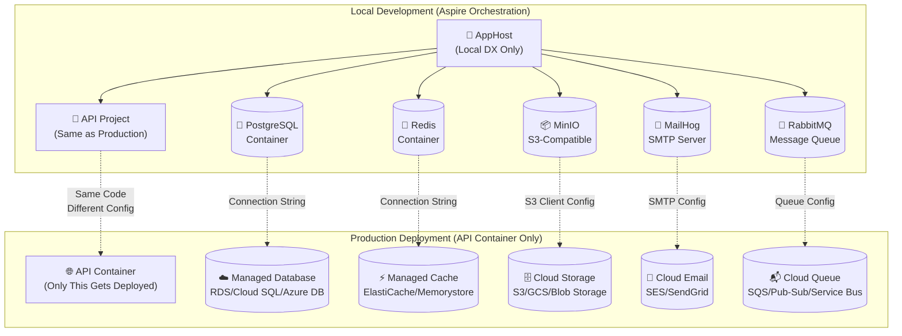

# NDC Deployment-Focused Architecture

## Core Philosophy

**Aspire for Local DX Only + Deploy API Only**

NDC uses .NET Aspire exclusively for local development orchestration while deploying only the actual web API/application to production container services.

## Architecture Overview



## Project Structure

```
MyApp/                              # Generated project
├── src/
│   ├── MyApp.AppHost/             # 🔧 LOCAL ONLY - Aspire orchestration
│   │   ├── Program.cs             #    Service container orchestration
│   │   └── *.csproj               #    Aspire hosting packages
│   │
│   ├── MyApp.Api/                 # 🚀 DEPLOYED - Main application
│   │   ├── Program.cs             #    Production-ready web API
│   │   ├── Services/              #    Service abstractions
│   │   ├── Data/                  #    Database models
│   │   ├── appsettings.json       #    Local development config
│   │   ├── appsettings.Production.json  # Production config
│   │   └── *.csproj               #    Production packages only
│   │
│   └── MyApp.ServiceDefaults/     # 📚 SHARED - Configuration helpers
│       └── Extensions.cs          #    Service registration helpers
│
├── Dockerfile                     # 🐳 Builds ONLY MyApp.Api
├── docker-compose.yml            # 🔧 Alternative local development
├── terraform/                     # ☁️ Cloud infrastructure
│   ├── main.tf                   #    Cloud services (RDS, S3, etc.)
│   ├── variables.tf              #    Configuration parameters
│   └── outputs.tf                #    Service endpoints/config
├── k8s/                          # ☸️ Kubernetes deployment (optional)
└── README.md                     # 📖 Deployment instructions
```

## Configuration-Driven Service Discovery

### Core Principle
The **API project** is completely **cloud-agnostic** and uses configuration to discover services, whether local or cloud.

### appsettings.json (Local Development)
```json
{
  "ConnectionStrings": {
    "Database": "Host=localhost;Port=5432;Database=myapp;Username=postgres;Password=postgres",
    "Redis": "localhost:6379"
  },
  "Services": {
    "Database": { "Type": "PostgreSQL", "Enabled": true },
    "Cache": { "Type": "Redis", "Enabled": true },
    "Storage": { "Type": "S3", "Enabled": true },
    "Email": { "Type": "SMTP", "Provider": "Local" },
    "MessageQueue": { "Type": "Memory", "Enabled": false }
  },
  "S3": {
    "ServiceUrl": "http://localhost:9000",  // MinIO
    "AccessKey": "minioadmin",
    "SecretKey": "minioadmin",
    "BucketName": "myapp-local"
  }
}
```

### appsettings.Production.json (Cloud Deployment)
```json
{
  "ConnectionStrings": {
    "Database": "", // Set via environment variable
    "Redis": ""     // Set via environment variable  
  },
  "Services": {
    "Database": { "Type": "PostgreSQL", "Enabled": true },
    "Cache": { "Type": "Redis", "Enabled": true },
    "Storage": { "Type": "S3", "Enabled": true },
    "Email": { "Type": "SMTP", "Provider": "SES" },
    "MessageQueue": { "Type": "SQS", "Enabled": true }
  },
  "S3": {
    "BucketName": "${S3_BUCKET_NAME}",  // From environment
    "Region": "${AWS_REGION}"
  }
}
```

## Deployment Workflows

### 1. Local Development
```bash
# Create project
ndc create webapp-aws --name MyApp --services database,cache,storage,mail

cd MyApp

# Option A: Use Aspire (Recommended)
dotnet run --project src/MyApp.AppHost
# ✅ All services orchestrated
# ✅ Aspire dashboard at https://localhost:17001
# ✅ API available at configured port

# Option B: Use Docker Compose
docker compose up
# ✅ All services in containers
# ✅ API available at configured port
```

### 2. Cloud Deployment (AWS Example)
```bash
# Deploy infrastructure
cd terraform
terraform init
terraform apply

# Build and deploy API only
docker build -t myapp-api .                    # Builds API project only
docker tag myapp-api $ECR_URL:latest
docker push $ECR_URL:latest

# App Runner automatically deploys the new image
# ✅ Only API container runs in production
# ✅ Connects to managed AWS services (RDS, ElastiCache, S3, SES, SQS)
```

### 3. Kubernetes Deployment
```bash
# Deploy to any Kubernetes cluster
cd k8s

# Configure secrets and config maps
kubectl apply -f configmap.yaml
# Update secrets with your cloud service credentials

# Deploy application
kubectl apply -f deployment.yaml
kubectl apply -f ingress.yaml

# ✅ API container deployed to K8s
# ✅ Connects to external cloud services
# ✅ Auto-scaling and load balancing
```

### 4. Docker Deployment  
```bash
# Production Docker deployment
docker compose -f docker-compose.prod.yml up

# ✅ API container with external service connections
# ✅ Configurable via environment variables
# ✅ Works with Docker Swarm, Portainer, etc.
```

## Service Configuration Pattern

### Service Factory (Dependency Injection)
```csharp
// ServiceCollectionExtensions.cs
public static IServiceCollection AddConfiguredServices(this IServiceCollection services, IConfiguration config)
{
    // Database - automatically chooses provider based on configuration
    var dbType = config["Services:Database:Type"];
    var connectionString = config.GetConnectionString("Database");
    
    switch (dbType)
    {
        case "PostgreSQL":
            services.AddDbContext<AppDbContext>(opt => opt.UseNpgsql(connectionString));
            break;
        case "MySQL": 
            services.AddDbContext<AppDbContext>(opt => opt.UseMySql(connectionString));
            break;
        case "SqlServer":
            services.AddDbContext<AppDbContext>(opt => opt.UseSqlServer(connectionString));
            break;
    }
    
    // Cache - Redis or in-memory fallback
    if (config.GetValue<bool>("Services:Cache:Enabled"))
    {
        var redisConnection = config.GetConnectionString("Redis");
        if (!string.IsNullOrEmpty(redisConnection))
            services.AddStackExchangeRedisCache(opt => opt.Configuration = redisConnection);
        else
            services.AddMemoryCache(); // Fallback
    }
    
    // Storage - S3 or local fallback
    if (config.GetValue<bool>("Services:Storage:Enabled"))
    {
        services.AddS3Storage(config.GetSection("S3"));
    }
    
    return services;
}
```

### Environment-Based Configuration
```csharp
// Program.cs - API project
var builder = WebApplication.CreateBuilder(args);

// Add all services based on configuration
builder.Services.AddConfiguredServices(builder.Configuration);

var app = builder.Build();

// API endpoints work the same regardless of service implementation
app.MapGet("/users", async (AppDbContext db) => await db.Users.ToListAsync());
app.MapPost("/cache/{key}", async (string key, ICacheService cache) => await cache.SetAsync(key, value));
app.MapPost("/files", async (IFormFile file, IStorageService storage) => await storage.SaveAsync(file));

app.Run();
```

## Deployment Platform Support

### Cloud Platforms
- ✅ **AWS App Runner** - Serverless containers with managed services
- ✅ **Google Cloud Run** - Serverless containers with managed services  
- ✅ **Azure Container Apps** - Serverless containers with managed services
- 🚧 **AWS ECS** - Managed container orchestration
- 🚧 **Google GKE** - Managed Kubernetes
- 🚧 **Azure AKS** - Managed Kubernetes

### Container Platforms
- ✅ **Docker Compose** - Local and production deployment
- ✅ **Kubernetes** - Any K8s cluster with manifests
- 🚧 **Docker Swarm** - Docker native orchestration
- 🚧 **Nomad** - HashiCorp container orchestration

### PaaS Platforms
- 🚧 **Railway** - Modern app deployment
- 🚧 **Render** - Full-stack cloud platform
- 🚧 **Fly.io** - Global application deployment
- 🚧 **Heroku** - Traditional PaaS

## Key Benefits

### ✅ **Aspire for Local DX Only**
- **Rich local development** with service orchestration
- **Aspire dashboard** for monitoring and debugging
- **Service discovery** automatically configured
- **Hot reload** and debugging support
- **No Aspire dependencies** in production

### ✅ **Deploy API Only**
- **Lightweight production containers** (only API code)
- **Cloud-native service connections** (RDS, ElastiCache, etc.)
- **Configuration-driven** service discovery
- **Platform agnostic** - works anywhere containers run
- **Standard container security** and optimization

### ✅ **Configuration Flexibility**
- **Switch database providers** via configuration
- **Enable/disable services** per environment
- **External service endpoints** easily configurable
- **Environment-specific settings** (dev/staging/prod)
- **Cloud-agnostic abstractions**

### ✅ **Multi-Platform Support**
- **Major cloud providers** (AWS, GCP, Azure)
- **Container orchestrators** (K8s, Docker Compose)  
- **PaaS platforms** (Railway, Render, Fly.io)
- **Consistent experience** across all platforms
- **Platform-specific optimizations**

This architecture provides the **best of both worlds**: amazing local development experience with Aspire, and flexible, lightweight production deployments that work anywhere containers run.