# NDC Multi-Cloud Architecture

## Universal Developer Experience

NDC provides **identical developer experience** across all major cloud platforms through a unified architecture approach.

## Platform Support Matrix

| Feature | AWS | Google Cloud | Azure | Container |
|---------|-----|-------------|-------|-----------|
| **Compute** | App Runner | Cloud Run | Container Apps | Docker/K8s |
| **Database** | RDS PostgreSQL | Cloud SQL | SQL Database | PostgreSQL |
| **Cache** | ElastiCache | Memorystore | Redis Cache | Redis |
| **Storage** | S3 | Cloud Storage | Blob Storage | File/S3 |
| **Queue** | SQS | Pub/Sub | Service Bus | RabbitMQ |
| **Status** | ✅ Production | ✅ Production | ✅ Production | ✅ Production |

## Unified Architecture Pattern

### Local Development (Identical for All Platforms)

```mermaid
graph TB
    subgraph "Aspire Orchestration (Same Everywhere)"
        AppHost["🎯 MyApi.AppHost<br/>(Local DX Only)"]
        LocalAPI["📱 MyApi.Api<br/>(Deployed Code)"]
        LocalDB[("🐘 PostgreSQL<br/>Container")]
        LocalRedis[("🔴 Redis<br/>Container")]
        LocalMinio[("📦 MinIO<br/>S3-Compatible")]
        LocalMail[("📧 MailHog<br/>SMTP")]
    end
    
    AppHost --> LocalAPI
    LocalAPI --> LocalDB
    LocalAPI --> LocalRedis
    LocalAPI --> LocalMinio
    LocalAPI --> LocalMail
```


### Production Deployment (Platform-Specific Infrastructure)

#### AWS Production

```mermaid
graph TB
    subgraph "AWS Services"
        API["🌐 App Runner<br/>(API Container)"]
        DB[("🐘 RDS PostgreSQL<br/>Managed")]
        Cache[("⚡ ElastiCache<br/>Redis")]
        Storage[("🗄️ S3 Bucket<br/>Object Storage")]
        Queue[("📬 SQS<br/>Message Queue")]
        Email[("📮 SES<br/>Email Service")]
    end
    
    API --> DB
    API --> Cache
    API --> Storage
    API --> Queue
    API --> Email
```


#### Google Cloud Production

```mermaid
graph TB
    subgraph "Google Cloud Services"
        API["🌐 Cloud Run<br/>(API Container)"]
        DB[("🐘 Cloud SQL<br/>PostgreSQL")]
        Cache[("⚡ Memorystore<br/>Redis")]
        Storage[("🗄️ Cloud Storage<br/>Bucket")]
        Queue[("📬 Pub/Sub<br/>Topics")]
        Email[("📮 SendGrid<br/>Email API")]
    end
    
    API --> DB
    API --> Cache
    API --> Storage
    API --> Queue
    API --> Email
```


#### Azure Production

```mermaid
graph TB
    subgraph "Azure Services"
        API["🌐 Container Apps<br/>(API Container)"]
        DB[("🐘 SQL Database<br/>Managed")]
        Cache[("⚡ Redis Cache<br/>Premium")]
        Storage[("🗄️ Blob Storage<br/>Account")]
        Queue[("📬 Service Bus<br/>Topics")]
        Email[("📮 SendGrid<br/>Add-on")]
    end
    
    API --> DB
    API --> Cache
    API --> Storage
    API --> Queue
    API --> Email
```


#### Container Platform

```mermaid
graph TB
    subgraph "Container Orchestration"
        API["🌐 API Pods<br/>(Replicated)"]
        DB[("🐘 PostgreSQL<br/>StatefulSet")]
        Cache[("⚡ Redis<br/>Deployment")]
        Storage[("🗄️ Persistent Volumes<br/>+ S3 Gateway")]
        Queue[("📬 RabbitMQ<br/>Cluster")]
        Email[("📮 SMTP Relay<br/>Service")]
        Nginx["🔀 Nginx<br/>Load Balancer"]
    end
    
    Nginx --> API
    API --> DB
    API --> Cache
    API --> Storage
    API --> Queue
    API --> Email
```


## Configuration-Driven Service Discovery

### Same Code, Different Services
The magic happens through **environment-based configuration**:

```csharp
// src/MyApi.Api/Program.cs - Same code everywhere!
var builder = WebApplication.CreateBuilder(args);

// Local: Aspire provides connection strings
// Production: Cloud platform injects connection strings
builder.AddServiceDefaults();

if (builder.Environment.IsDevelopment())
{
    // Aspire development services
    builder.AddNpgsqlDataSource("postgres");
    builder.AddRedis("cache");
}
else
{
    // Production services (all platforms)
    builder.AddNpgsqlDataSource(
        builder.Configuration.GetConnectionString("DefaultConnection")!);
    builder.AddStackExchangeRedis(
        builder.Configuration.GetConnectionString("Redis")!);
}
```

### Environment Variables (Platform-Specific)

**AWS Environment:**
```bash
DefaultConnection=Server=myapp.123.rds.amazonaws.com;Database=myapp;...
Redis=myapp.abc123.cache.amazonaws.com:6379
S3_BUCKET=myapp-storage-bucket
SQS_QUEUE_URL=https://sqs.us-east-1.amazonaws.com/123/myapp-queue
```

**Google Cloud Environment:**
```bash
DefaultConnection=Server=/cloudsql/project:region:instance;Database=myapp;...
Redis=10.1.2.3:6379
GCS_BUCKET=myapp-storage-bucket
PUBSUB_TOPIC=projects/myproject/topics/myapp-topic
```

**Azure Environment:**
```bash
DefaultConnection=Server=myapp.database.windows.net;Database=myapp;...
Redis=myapp.redis.cache.windows.net:6380,ssl=True
STORAGE_ACCOUNT=myappstorage
SERVICEBUS_CONNECTION=Endpoint=sb://myapp.servicebus.windows.net/...
```

## Deployment Workflow (Universal)

### 1. Containerization Strategy
```dockerfile
# Same Dockerfile for all platforms
FROM mcr.microsoft.com/dotnet/aspnet:9.0 AS runtime
WORKDIR /app

# Copy only API project (not AppHost)
COPY src/MyApi.Api/bin/Release/net9.0/publish/ ./

EXPOSE 8080
ENTRYPOINT ["dotnet", "MyApi.Api.dll"]
```

### 2. Infrastructure as Code
Each platform includes complete Terraform:

```
examples/working-{platform}-template/
├── terraform/
│   ├── main.tf          # Platform-specific resources
│   ├── variables.tf     # Configuration options  
│   ├── outputs.tf       # Service URLs and connections
│   └── provider.tf      # Cloud provider setup
├── src/                 # Identical application code
└── README.md           # Platform-specific deployment guide
```

### 3. Universal Deployment Commands

**Build (Same everywhere):**
```bash
docker build -t myapi:latest .
```

**Deploy (Platform-specific push, same image):**
```bash
# AWS
aws ecr get-login-password | docker login --username AWS --password-stdin $ECR_URL
docker tag myapi:latest $ECR_URL:latest && docker push $ECR_URL:latest

# Google Cloud  
gcloud auth configure-docker us-central1-docker.pkg.dev
docker tag myapi:latest $REPO_URL:latest && docker push $REPO_URL:latest

# Azure
az acr login --name $ACR_NAME
docker tag myapi:latest $ACR_URL:latest && docker push $ACR_URL:latest

# Container
docker-compose up -d  # or kubectl apply -f k8s/
```

## Benefits of This Approach

### ✅ Developer Benefits
- **Write Once, Deploy Anywhere**: Same codebase works on all platforms
- **Consistent Local DX**: Aspire orchestration identical everywhere
- **No Vendor Lock-in**: Switch platforms by changing infrastructure only
- **Full Feature Parity**: Every platform gets the same capabilities

### ✅ Operations Benefits  
- **Platform Expertise**: Use best services for each cloud
- **Cost Optimization**: Platform-specific resource sizing
- **Compliance**: Meet regional/regulatory requirements per platform
- **Risk Mitigation**: Multi-cloud strategy without code changes

### ✅ Architecture Benefits
- **Separation of Concerns**: Application logic vs. infrastructure
- **Configuration-Driven**: Environment variables control behavior
- **Container Native**: Leverage platform container services
- **Production Ready**: Real-world security and scaling practices

## Next Steps

1. **Choose Your Platform**: Pick the platform that fits your requirements
2. **Local Development**: Use Aspire for consistent development experience  
3. **Production Deployment**: Follow platform-specific deployment guides
4. **Multi-Platform**: Deploy the same application to multiple clouds

The NDC approach proves that **multi-cloud doesn't have to mean multi-complexity**.